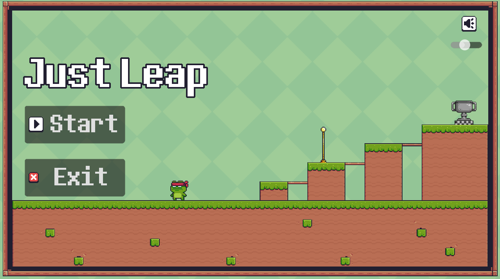

# Just Leap

## Description
A simple platformer where you just have to reach the flag and step on the trophy to clear the levels. Easy, right? Well, that's up to you. 

This is a short game created as an excuse to learn the basics of Godot, but I enjoyed the process and the result enough to publish it here.

## Screenshot

## Download
You can download the playable Windows version from the [Releases](../../releases) section.

## Assets
Since this was a learning project, I wanted a fast way to get nice assets without spending too much time on them. In future games, I'll put more focus on this, but for now, a huge thanks to these creators:

* **Graphics:** Pixel Adventure by Pixel Frog (modified a bit to fit my needs).
* **SFX:** Free retro bundle by Jeageroni on Itch.io, plus some sounds from YouTube, Pixabay, and FreeToUse.
* **Music Tracks:**
  * *Quiet Bounce* - Aventure
  * *Playing Games* - Zambolino
  * *Up In My Jam* - Kubbi

## Note
'Just Leap' is my very first game in the Godot engine (the completed one haha). It doesn't have super hard or highly original mechanics, but I wanted to make something special to mark the beginning of my journey with this beautiful engine.

The process involved watching tutorials, reading documentation, and sometimes asking AI why my main menu suddenly disappeared (only to spend hours realizing an invisible shader was hiding it). Development took much longer than I expected, but I guess that's one thing I had to go through eventually: "missing the expected completion deadline".

To be honest, the code is a bit of a mess XD. There are unused files and definitely better ways to do things, but I think that's okay for my first time. Like my other personal projects, I'm leaving it here as a record of my progress, and just in case someone wants to test it out!
